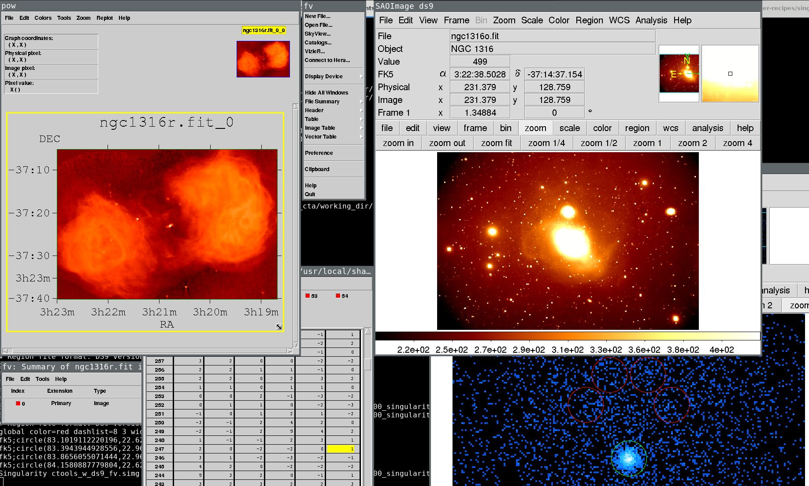

# Singularity container for ctools

### Building:

* copy the recipe
* `sudo singularity build container container.recipe`
  Note: the build process can require mins
* use it!

### What you can do?

* `singularity shell -H /place/where/work container`
* [ctools docs](http://cta.irap.omp.eu/ctools/index.html)

### Note

* the building process create a vendors dir in `/tmp` and download with the host
  `wget` the source file. This choice has a lot of implication.
  If you dislike this practice or the host has not the wget program, fix %setup
  and/or %files section.

### Augment container

The `add_*.recipe` are addon to ctools container to provide `fv` and `ds9`
visualization feature.

These recipe point to a `base_container.simgs`, so the trick is:
1. change recipes' From header.
2. create a symbolic link to ctools container called `base_container.simgs` and
   build the "add recipe".

#### All together

With the full composed container, I can simulate data with ctobssim, create
skymaps, analyze them with ctools, and visualize all the fits with fv or ds9.

