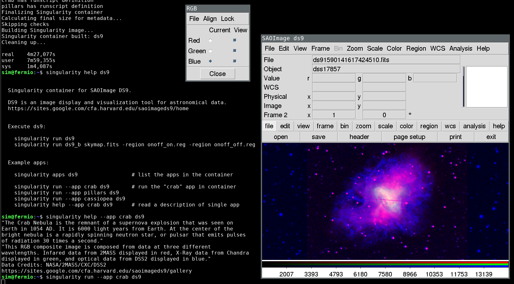
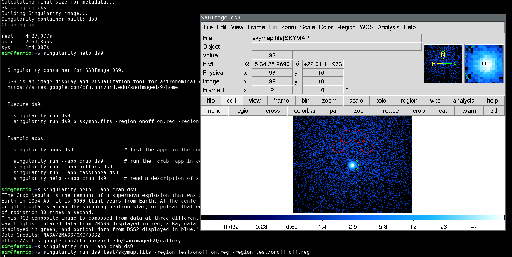

# Build a singularity container for SAO ds9.

### Building / Installation:

* copy the recipe in $dir
* `wget -P $dir/vendor http://ds9.si.edu/download/source/ds9.8.1.tar.gz`
* `sudo singularity build ds9 ds9.recipe`
  Note: the build process can require mins (t < 5 min)
* use it!

### What you can do?

* `singularity help ds9`
* [ds9 docs](https://sites.google.com/cfa.harvard.edu/saoimageds9/documentation)

### Note

* the container apps want to show the potential of ds9 as illustrated in
  [Gallery section](https://sites.google.com/cfa.harvard.edu/saoimageds9/gallery).
  The fits file are fetched online, so you need internet connection.

### Using the container

